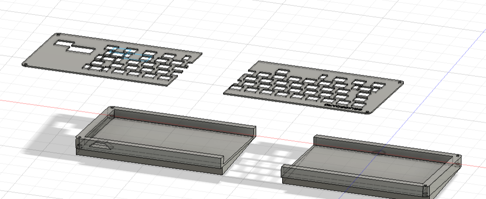

Total hours spent: ~30 hours

# Day 1 (8/7) ~8 hours  
After spending some time researching different keyboard layouts and keycaps I decided on a 60% ANSI layout based a bit on my laptop keyboardo mainly for cost and simplicity reasons as this is my first time designing a keyboard.
Next, I defined the rows and columns of the keyboard and created the schematic in kicad, deciding to add an oled display.

At this point I realised that the arduino pro micro was one GPIO pin short of what i needed (i miscounted) so i changed the microcontroller to a raspberry pi pico. i left GPIO0 and GPIO1 free for i2c for the OLED display. I also decided to add a rotary encoder due to having a couple of free GPIO pins. I researched about pullup resistors and found that using external pullups in this cae wouldn't be necessary as the pico had internal ones you can enable. I decided to sue D0-35 diodes as they are throughole dioeds so it will be much easier than hand soldering tiny smd diodes.
Current schmatic:  
 

# Day 2 (17/7) ~6 hours
I then decided that making a backlit keyboard would be pretty cool and would be a way to take the project further, make it mroe unique and also as a way to prcatice smd solderign that I learnt at undecity. I added SK6812 mini LEDs to the schematic as these are cheap from aliexpress and were similar to the ones we used in undercity but are small enough to fit under the keycaps (the full sized ones aren't). There weren't enough GPIO pins remaining on the pico to have every keyboard led layer independently controllable so I decided to combine the top and bottom row to the same GPIO pin and then have the rows containing letter keys to be conencted to their own GPIO pins for independent control which I'll think more about when writign the firmware. I also added a pushbutton to reset the pico for easier debugging.  
Completed schematic!:  

# Day 3 (18/7) ~6 hours
Next I ended up going back and changing the keyboard layout and redoing the schematic to make sure that there is onlly oen switch per key and using footprints for different sized keys: 

updated schematic: 
Adter rewiring a bunch of times i realised it isnt feasible to power this many LEDs off one pico. After doing some research, the VBUS on the pico can supply ~500mA and each mini LED will draw up to 60mA. I dont want to use an external power supply so if i keep the LEDs to ~30% birghtness and one colour (~20 mA) i should be aply to safely power about 10 which i'll space around the perimiter of the keyboard for some subtle backlighting around the sides of the board. I made this power budget table to make sure that everything is well under the 500mA VBUS max draw.
| Component              | Number | Voltage | Current draw (per unit) | Total Current |
|-----------------------|----------|---------|---------------------|---------------|
| SK6812 Mini LEDs      | 10       | 5V      | 15–25 mA  (low brightness and single colour)          | 150–250 mA    |
| OLED Display (SSD1306)| 1        | 3.3V    | 20–30 mA            | 30 mA         |
| Rotary Encoder         | 1        | 3.3V    | <10 mA              | 5–10 mA       |
| Raspberry Pi Pico      | 1        | 5V/3.3V | ~50–70 mA           | 70 mA         |
| **Total**    | —        | —       | —                   | **255–360 mA** |

Next I tediously placed the components and routed the pcb and added the LEDs afterwards. I will solder the didoes to the back of the pcb. I also decided that the oled can display caps/num/shift lock and wpm and that the rotary encoder will be used like a scroll wheel with SW being left click. Next, i played around with pico/oled/enocder erangements, drew the edge cuts and exported the pcb into jlcpcb to make sure it won't cost too much with the size.

# Day 4 (19/7) ~12 hours

When routing the pcb I made sure that all the traces were at least 0.2mm apart and that there weren't any sharp 90 degree turns. I also made sure that traces wouldnt pass between the pins on the pico just in case this caused some short as there wasn't much clearance here. Hours later and its finally wired. Now time for the LEDs. in the end i decided to go for 8 LEDs to be extra safe that we aren't drawing too much current. Finally the routing is done: 
Now I will add some silkscreen, keeping to the underwater theme. I kept the silkscreen to the emptish areas of the pcb (that just ocntain vias and traces) and tried to make it not cover any througholes, just in case this causes a problem in the manufacturing process.  
 
I also rounded the edges of the pcb to make it look more asthetically pleasing and added some mounting holes so the pcb can be screwed into the case. I skipped the upper left corner as the mountin hole would be too close to the components and I couldn't justify increasing the size of the board (and so cost) for an extra mounting hole that isn't really needed. Additionall I added a ground fill zone around the entire both sides of the board and added some vias around the mounting holes and to large copper sections. Exporting to JLCPCB I checked the cost of the pcb to make sure it was reasonable before moving onto CAD. Here is the final schematic and pcb:  

Only warnings about silkscreen overlap which is fine. I decided to try doing CAD in onshape instead of fusion for this project. Firstl, i found some 3d models online for the pcb components and assigned them to the footprints to make a nicer looking model which i then imported into onshape to build the case around. (note that on the oled 3d model gnd and vcc are the opposite way to what they are on the actual module im getting, the connections on the pcb are correct. additioanlly the actual oled screen is a bit longer so will be more in line with the rotary encoder in reality) Finally, I undertook the tedious task of rewiring a lot of the pcb as i had forgotton to include stabilisers. I added stabilisers to all keys >=2u so they can be used properly and this required replacing and rerouting all of the LEDs as they got in the way of the stabilizers in their previous posiitons.Note that while the diodes appear on the front side i will solder them to the back side so there is room for the keycaps. In the end i decided to just have the spacebar and shift key backlit and to have two status leds next to the oled display. this was because id need multiple leds per key for the backlight as they have to be run on low brightness due to the limited power budget from the pico.
Here is the actual final pcb after severla hours of rerouting:   

Next for the CAD. I imported the pcb into fusion and used the hackpad tutorial to build a base for the case and cut holes for the oled display and rotary encoder, i made the case. this took me a long time as my laptop is not very good and fusion crashed 3 times. I can't do renders on my laptop but I will be painting the case in a sandy yellow and using blue keycaps.

# Day 5 (20/7) ~4 hours
I decided to write the firmware in arduino code instead of kmk as i'm more familiar with it. I didn't journal much for this section but in summary i used random online documentation and tutorials. I started by defining the keybaord layout and all the GPIO pin assignments. I then split the intended features into different functions to work on them independently for easier debugging and to avoid spaghetti code. Then using random online tutorials including from adafruit and instructables i wrote code for the oled, rotary encoder and keyboard using tinyUSB. There are probably soem logic issues in my code but i will sort them out when i have the physical hardware to test it on.

Other things i did today included formatting the repo for proper submission, checking over all the footprints and wiring. I then finished and polished the case, making it a bit more ergonomic by addign wedges to the bottom for a 5 degree tilt and splitting it into two for 3d printing. I then submitted the project (at around 4am).

I will glue these halves together. Also there is a small overhang so I will print with supports.

